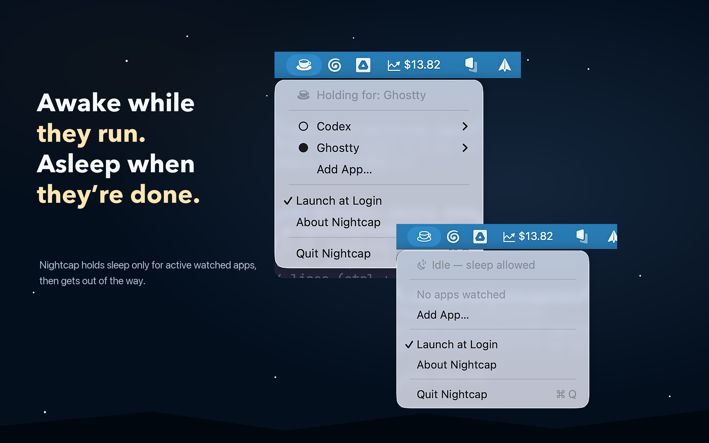

<div align="center">
  
  <h1>Nightcap</h1>
  <p>Keep your Mac awake while specific apps are running.</p>

  [](https://github.com/Abdo-codes/Nightcap/actions/workflows/ci.yml)
  [](LICENSE)
  [](#requirements)

  
</div>

---

## What it is

A tiny menu-bar app that prevents your Mac from going to idle sleep while
selected apps are running. Add Ghostty, Xcode, your dev server, Zoom — anything
where a 5-minute sleep timeout would interrupt real work. When the watched app
quits, the assertion releases automatically and your Mac sleeps as configured.

Unlike `caffeinate` or always-on solutions, Nightcap is **event-driven**: it
holds a kernel-level power assertion only while watched apps are alive, and
releases the moment they exit. Zero polling, zero battery overhead when idle.

## How it works

- Watches `NSWorkspace` launch/terminate notifications for your selected bundle IDs
- Holds `kIOPMAssertionTypePreventUserIdleSystemSleep` via IOKit when any watched app is running
- Reconciles state on system wake (handles forced kills, sleep/wake cycles)
- Runs fully sandboxed — no privileged helpers, no shell scripts, no LaunchAgents
- Persists your watched-app list to a local JSON file in the app container

## Requirements

- macOS 14.0 (Sonoma) or later
- Xcode 16+ to build from source

## Install

**Mac App Store** — coming soon.

**Homebrew**:

```bash
brew install --cask Abdo-codes/tap/nightcap
```

Maintainer release notes live in [docs/HOMEBREW.md](docs/HOMEBREW.md).

**Build from source:**

```bash
git clone https://github.com/Abdo-codes/Nightcap.git
cd Nightcap
brew install xcodegen
xcodegen
open Nightcap.xcodeproj
```

Press ⌘R in Xcode to run. The app appears as a cup-and-saucer icon in your
menu bar — no Dock icon.

## Usage

1. Click the cup icon in your menu bar
2. Click **Add App…**, pick the app you want to watch (e.g. Ghostty)
3. While that app is running, the icon switches to the filled-cup state and
   your Mac won't sleep
4. Optionally enable **Launch at Login** to start Nightcap on boot

Right-click (or click into the submenu of) a watched app to remove it.

## Tech

- **Swift 5** + **SwiftUI** — modern declarative UI
- **MenuBarExtra** (macOS 13+) — native menu-bar entry point
- **TCA** (The Composable Architecture) — reducer-based state management
- **IOKit `IOPMAssertion`** — kernel-level sleep prevention
- **`SMAppService`** — sandbox-safe launch-at-login (macOS 13+)
- **xcodegen** — project file generation from `project.yml`

## Testing

```bash
xcodebuild test -project Nightcap.xcodeproj -scheme Nightcap \
  -destination 'platform=macOS,arch=arm64'
```

7 unit tests cover launch/terminate/wake reconciliation, multi-instance
termination, duplicate-add no-op, launch-at-login error rollback, and quit
releases the assertion.

## Privacy

Nightcap collects **zero** data. No analytics, no telemetry, no network
calls. The watched-app list is stored locally in your app sandbox container
and never leaves your machine. See [PRIVACY.md](PRIVACY.md) for the full
policy.

## Contributing

PRs welcome — see [CONTRIBUTING.md](CONTRIBUTING.md). The codebase is small
and well-tested; good entry points are listed under "Good first issues" on
the issue tracker.

## License

MIT — see [LICENSE](LICENSE). You're free to fork, modify, and redistribute,
including shipping your own derivative on the Mac App Store, as long as the
copyright notice stays intact.
